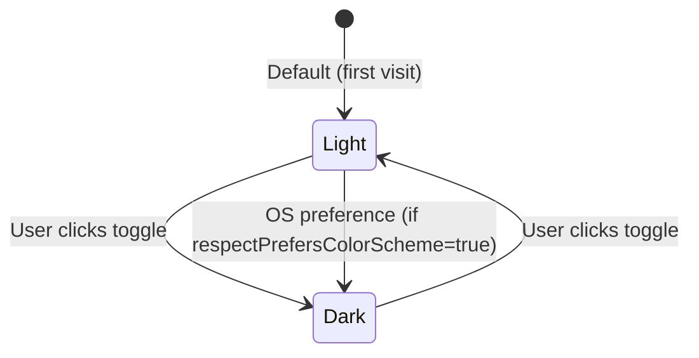
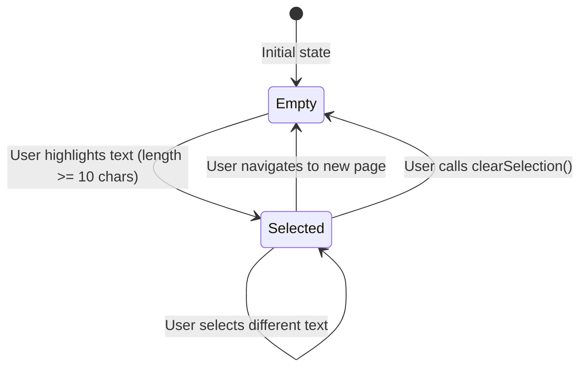
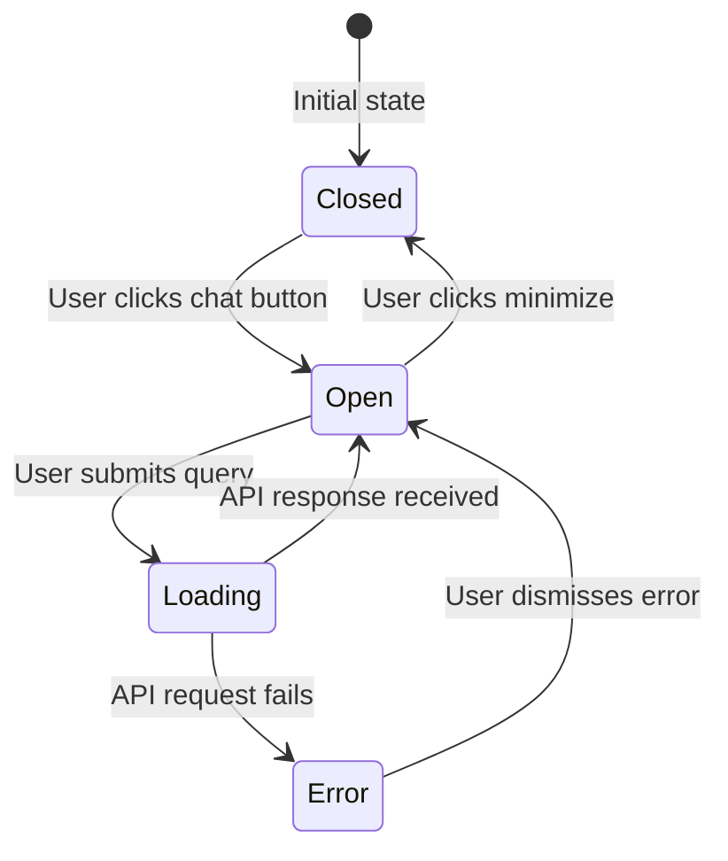
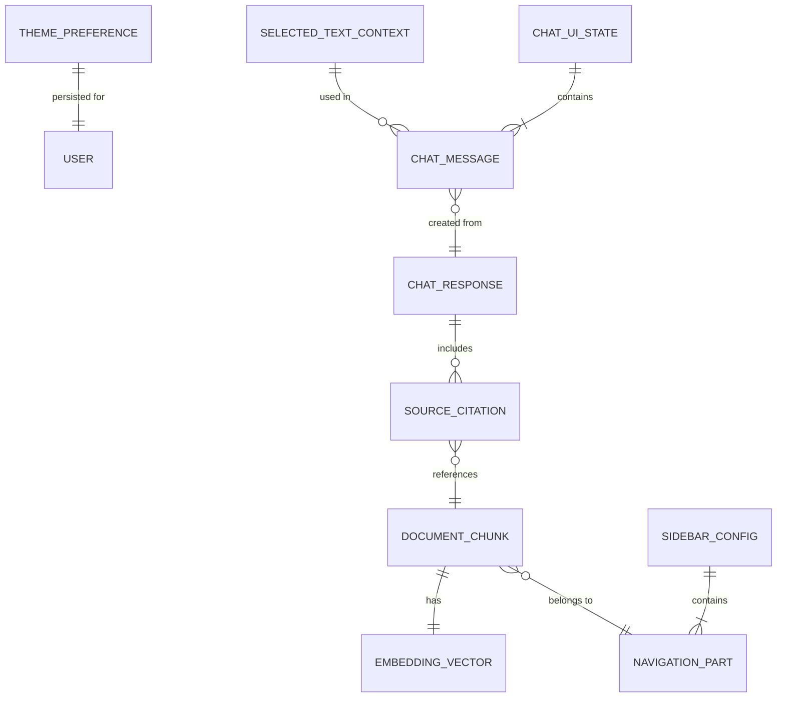
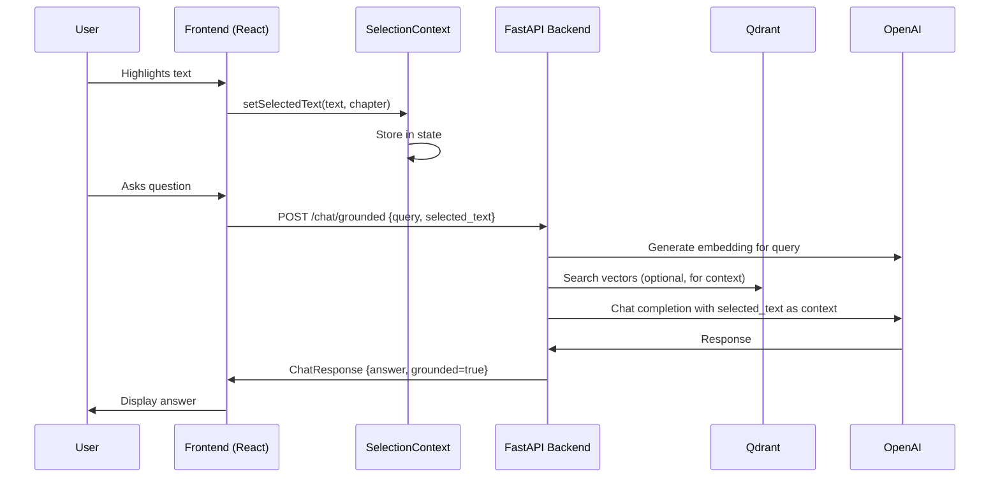
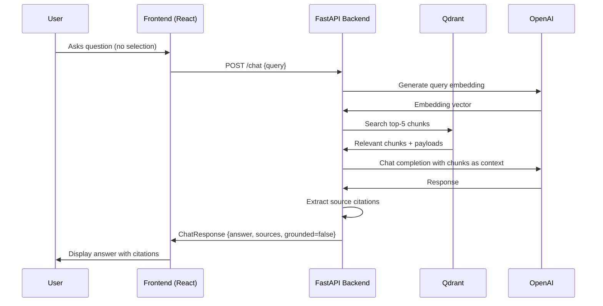

# Data Model: UI/UX Rework and Phase 2 RAG Chatbot Integration

**Feature**: 005-ui-ux-rag-phase2
**Date**: 2025-11-30
**Status**: Phase 1 Design

## Overview

This document defines the data entities, their attributes, relationships, and validation rules for the UI/UX rework and RAG chatbot integration. Entities are categorized by domain (Frontend State, API Models, Vector Store, Configuration).

---

## Entity Catalog

### Frontend Domain (React State)

1. **Theme Preference**
2. **Selected Text Context**
3. **Chat UI State**

### API Domain (Pydantic Models)

4. **ChatRequest** (global context mode)
5. **GroundedChatRequest** (selected text mode)
6. **ChatResponse**
7. **SourceCitation**

### Vector Store Domain (Qdrant)

8. **Document Chunk**
9. **Embedding Vector**

### Configuration Domain

10. **Navigation Part**
11. **Sidebar Configuration**

---

## 1. Theme Preference

**Domain**: Frontend (React State + localStorage)
**Purpose**: Persist user's light/dark mode choice across sessions

### Attributes

| Attribute | Type | Required | Default | Description |
|-----------|------|----------|---------|-------------|
| `theme` | `'light' \| 'dark'` | Yes | `'light'` | Active theme mode |
| `lastChanged` | `Date` | No | `null` | Timestamp of last theme toggle |

### Storage

- **Location**: Browser localStorage (key: `theme`)
- **Managed By**: Docusaurus `useColorMode()` hook (automatic)

### Validation Rules

- `theme` must be either `'light'` or `'dark'` (enforced by TypeScript)
- Falls back to `'light'` if localStorage value is corrupted

### State Transitions



### Example (TypeScript)

```typescript
// Docusaurus useColorMode hook
import {useColorMode} from '@docusaurus/theme-common';

const {colorMode, setColorMode} = useColorMode();
// colorMode: 'light' | 'dark'
// setColorMode: (mode: 'light' | 'dark') => void
```

---

## 2. Selected Text Context

**Domain**: Frontend (React Context)
**Purpose**: Capture user-highlighted text for grounded chatbot queries

### Attributes

| Attribute | Type | Required | Default | Description |
|-----------|------|----------|---------|-------------|
| `text` | `string` | Yes | `''` | The highlighted text content |
| `sourceChapter` | `string \| null` | No | `null` | Chapter slug where text was selected |
| `selectionTime` | `Date` | No | `null` | When selection occurred |

### Storage

- **Location**: React Context (`SelectionContext`)
- **Lifetime**: Current session only (cleared on navigation or manual clear)

### Validation Rules

- `text` must be trimmed and have minimum length of 10 characters
- `text` maximum length: 10,000 characters (frontend validation)
- If `text` exceeds 6,000 tokens (~4,500 words), warn user but still send

### State Transitions



### Example (TypeScript)

```typescript
interface SelectionContextType {
  selectedText: string;
  sourceChapter: string | null;
  setSelectedText: (text: string, chapter?: string) => void;
  clearSelection: () => void;
}

// Usage
const {selectedText, clearSelection} = useContext(SelectionContext);
```

---

## 3. Chat UI State

**Domain**: Frontend (React Component State)
**Purpose**: Manage chatbot widget UI state (open/closed, messages, loading)

### Attributes

| Attribute | Type | Required | Default | Description |
|-----------|------|----------|---------|-------------|
| `isOpen` | `boolean` | Yes | `false` | Whether chat widget is expanded |
| `messages` | `ChatMessage[]` | Yes | `[]` | Conversation history |
| `isLoading` | `boolean` | Yes | `false` | Whether API request is in flight |
| `error` | `string \| null` | No | `null` | Error message (if API call failed) |
| `conversationId` | `string \| null` | No | `null` | Session identifier (future: multi-turn) |

### Nested Entity: Chat Message

| Attribute | Type | Required | Description |
|-----------|------|----------|-------------|
| `id` | `string` | Yes | Unique message ID (UUID) |
| `content` | `string` | Yes | Message text |
| `sender` | `'user' \| 'assistant'` | Yes | Who sent the message |
| `timestamp` | `Date` | Yes | When message was created |
| `sources` | `SourceCitation[]` | No | Chapter citations (assistant messages only) |
| `grounded` | `boolean` | No | Whether response was grounded in selected text |

### Validation Rules

- `messages` array preserves insertion order (oldest first)
- Maximum `messages` length: 100 (prevent memory bloat in long sessions)
- `isLoading` must be `false` before sending new message (prevent duplicate requests)

### State Transitions



### Example (TypeScript)

```typescript
interface ChatUIState {
  isOpen: boolean;
  messages: ChatMessage[];
  isLoading: boolean;
  error: string | null;
  conversationId: string | null;
}

interface ChatMessage {
  id: string;
  content: string;
  sender: 'user' | 'assistant';
  timestamp: Date;
  sources?: SourceCitation[];
  grounded?: boolean;
}
```

---

## 4. ChatRequest (Global Context Mode)

**Domain**: API (Pydantic Model)
**Purpose**: Request model for `/chat` endpoint (full-book search)

### Attributes

| Attribute | Type | Required | Default | Description |
|-----------|------|----------|---------|-------------|
| `query` | `str` | Yes | N/A | User's question |
| `conversation_id` | `str \| None` | No | `None` | Optional session ID |

### Validation Rules (Pydantic)

```python
from pydantic import BaseModel, Field, field_validator

class ChatRequest(BaseModel):
    query: str = Field(..., min_length=3, max_length=1000)
    conversation_id: str | None = None

    @field_validator('query')
    def validate_query(cls, v):
        if not v.strip():
            raise ValueError('Query cannot be empty or whitespace')
        return v.strip()
```

### Example Request (JSON)

```json
{
  "query": "What are the main components of ROS 2?",
  "conversation_id": "550e8400-e29b-41d4-a716-446655440000"
}
```

---

## 5. GroundedChatRequest (Selected Text Mode)

**Domain**: API (Pydantic Model)
**Purpose**: Request model for `/chat/grounded` endpoint ("Magna Carta" mode)

### Attributes

| Attribute | Type | Required | Default | Description |
|-----------|------|----------|---------|-------------|
| `query` | `str` | Yes | N/A | User's question |
| `selected_text` | `str` | Yes | N/A | Highlighted book excerpt |
| `source_chapter` | `str \| None` | No | `None` | Chapter slug (optional metadata) |
| `conversation_id` | `str \| None` | No | `None` | Optional session ID |

### Validation Rules (Pydantic)

```python
class GroundedChatRequest(BaseModel):
    query: str = Field(..., min_length=3, max_length=1000)
    selected_text: str = Field(..., min_length=10, max_length=10000)
    source_chapter: str | None = None
    conversation_id: str | None = None

    @field_validator('selected_text')
    def validate_selection(cls, v):
        if len(v.split()) < 5:  # Minimum 5 words
            raise ValueError('Selected text too short')
        return v.strip()
```

### Example Request (JSON)

```json
{
  "query": "Explain how nodes communicate",
  "selected_text": "ROS 2 nodes communicate via topics, which are named buses that use a publish-subscribe pattern. Publishers send messages to topics, and subscribers receive them. This decouples node implementations and allows for flexible system architectures.",
  "source_chapter": "module-1/nodes-topics-services",
  "conversation_id": "550e8400-e29b-41d4-a716-446655440000"
}
```

---

## 6. ChatResponse

**Domain**: API (Pydantic Model)
**Purpose**: Response model for both `/chat` and `/chat/grounded` endpoints

### Attributes

| Attribute | Type | Required | Default | Description |
|-----------|------|----------|---------|-------------|
| `answer` | `str` | Yes | N/A | LLM-generated response |
| `sources` | `list[SourceCitation]` | No | `[]` | Chapter citations (global mode only) |
| `grounded_in` | `str \| None` | No | `None` | Confirmation of selected text (grounded mode only) |
| `conversation_id` | `str` | Yes | N/A | Session identifier |
| `grounded` | `bool` | Yes | N/A | Whether response used selected text |

### Validation Rules (Pydantic)

```python
class ChatResponse(BaseModel):
    answer: str = Field(..., min_length=1)
    sources: list[SourceCitation] = Field(default_factory=list)
    grounded_in: str | None = None
    conversation_id: str
    grounded: bool
```

### Example Response (Global Mode)

```json
{
  "answer": "According to Chapter 7 on ROS 2 Nodes, Topics, and Services, the main components include...",
  "sources": [
    {
      "chapter": "module-1/nodes-topics-services",
      "title": "ROS 2 Nodes, Topics, and Services",
      "relevance_score": 0.92
    }
  ],
  "conversation_id": "550e8400-e29b-41d4-a716-446655440000",
  "grounded": false
}
```

### Example Response (Grounded Mode)

```json
{
  "answer": "Based on the selected text, nodes communicate via topics using a publish-subscribe pattern...",
  "grounded_in": "ROS 2 nodes communicate via topics...",
  "conversation_id": "550e8400-e29b-41d4-a716-446655440000",
  "grounded": true
}
```

---

## 7. SourceCitation

**Domain**: API (Pydantic Model)
**Purpose**: Reference to book chapter where information was retrieved

### Attributes

| Attribute | Type | Required | Default | Description |
|-----------|------|----------|---------|-------------|
| `chapter` | `str` | Yes | N/A | Chapter slug (e.g., "module-1/ros2-architecture") |
| `title` | `str` | Yes | N/A | Human-readable chapter title |
| `relevance_score` | `float` | No | `None` | Cosine similarity (0.0-1.0) |

### Validation Rules (Pydantic)

```python
class SourceCitation(BaseModel):
    chapter: str = Field(..., min_length=1)
    title: str = Field(..., min_length=1)
    relevance_score: float | None = Field(None, ge=0.0, le=1.0)
```

### Example

```json
{
  "chapter": "module-3/isaac-sim-setup",
  "title": "Isaac Sim Setup & Basics",
  "relevance_score": 0.87
}
```

---

## 8. Document Chunk

**Domain**: Vector Store (Qdrant Payload)
**Purpose**: Indexed book content for vector search

### Attributes (Qdrant Payload Schema)

| Attribute | Type | Required | Description |
|-----------|------|----------|-------------|
| `chunk_id` | `str` | Yes | Unique identifier (UUID) |
| `text` | `str` | Yes | Chunk content (1024 tokens) |
| `chapter_id` | `str` | Yes | Parent chapter slug |
| `chapter_title` | `str` | Yes | Human-readable chapter name |
| `part` | `str` | Yes | Sidebar part (e.g., "Core Technologies") |
| `chunk_index` | `int` | Yes | Position in chapter (0-indexed) |
| `token_count` | `int` | Yes | Exact token count (tiktoken) |
| `created_at` | `str` | Yes | ISO 8601 timestamp |

### Validation Rules

- `text` must be non-empty after stripping whitespace
- `token_count` must match actual tiktoken count (validation during indexing)
- `chunk_index` must be sequential within a chapter (0, 1, 2, ...)

### Example (Qdrant Payload)

```python
payload = {
    "chunk_id": "a1b2c3d4-e5f6-7890-abcd-ef1234567890",
    "text": "ROS 2 is a middleware framework for building robot applications...",
    "chapter_id": "module-1/ros2-architecture",
    "chapter_title": "ROS 2 Architecture Overview",
    "part": "Core Technologies",
    "chunk_index": 0,
    "token_count": 1024,
    "created_at": "2025-11-30T12:00:00Z"
}
```

---

## 9. Embedding Vector

**Domain**: Vector Store (Qdrant Vector)
**Purpose**: Semantic representation for vector search

### Attributes

| Attribute | Type | Required | Description |
|-----------|------|----------|-------------|
| `vector` | `list[float]` | Yes | 1536-dimensional embedding (text-embedding-3-small) |
| `id` | `str` | Yes | Same as `chunk_id` in payload |

### Validation Rules

- `vector` must have exactly 1536 dimensions
- All values must be `float` (normalized by OpenAI API)

### Example (Conceptual)

```python
{
    "id": "a1b2c3d4-e5f6-7890-abcd-ef1234567890",
    "vector": [0.0234, -0.0145, 0.0892, ...],  # 1536 floats
    "payload": {...}  # Document Chunk from above
}
```

---

## 10. Navigation Part

**Domain**: Configuration (Docusaurus Sidebar)
**Purpose**: High-level organizational grouping of chapters

### Attributes

| Attribute | Type | Required | Description |
|-----------|------|----------|-------------|
| `label` | `string` | Yes | Part name (e.g., "Getting Started") |
| `emoji` | `string \| null` | No | Optional icon (e.g., "🚀") |
| `collapsed` | `boolean` | Yes | Whether part is collapsed by default |
| `items` | `SidebarItem[]` | Yes | Nested chapters or subcategories |

### Validation Rules

- `label` must be unique across all parts
- `items` array must have at least 1 element
- `collapsed` defaults to `true` (except for "Getting Started")

### Example (TypeScript)

```typescript
interface NavigationPart {
  type: 'category';
  label: string;
  collapsed: boolean;
  items: SidebarItem[];
}

const gettingStarted: NavigationPart = {
  type: 'category',
  label: '🚀 Getting Started',
  collapsed: false,
  items: [
    'physical-ai/introduction',
    'physical-ai/why-physical-ai-matters',
    ...
  ]
};
```

---

## 11. Sidebar Configuration

**Domain**: Configuration (Docusaurus)
**Purpose**: Complete sidebar structure for book navigation

### Attributes

| Attribute | Type | Required | Description |
|-----------|------|----------|-------------|
| `tutorialSidebar` | `NavigationPart[]` | Yes | Array of 5 parts |

### Validation Rules

- Must contain exactly 5 parts (per spec requirement)
- Part order must follow pedagogical progression

### Example (TypeScript)

```typescript
const sidebars: SidebarsConfig = {
  tutorialSidebar: [
    gettingStarted,      // Part 1
    coreTechnologies,    // Part 2
    aiIntegration,       // Part 3
    hardwareDeployment,  // Part 4
    capstoneResources    // Part 5
  ]
};
```

---

## Entity Relationships



### Relationship Descriptions

1. **User → Theme Preference**: One-to-one (each user has one theme preference)
2. **Selected Text → Chat Message**: One-to-many (one selection can generate multiple messages if user asks follow-up questions)
3. **Chat UI State → Chat Message**: One-to-many (UI state contains message history)
4. **Chat Message → Chat Response**: One-to-one (each user message gets one assistant response)
5. **Chat Response → Source Citation**: One-to-many (one response can cite multiple chapters)
6. **Source Citation → Document Chunk**: Many-to-one (multiple citations can reference same chunk)
7. **Document Chunk → Embedding Vector**: One-to-one (each chunk has one embedding)
8. **Document Chunk → Navigation Part**: Many-to-one (chunks belong to chapters, which belong to parts)
9. **Sidebar Config → Navigation Part**: One-to-many (sidebar contains 5 parts)

---

## Data Flow Diagrams

### Flow 1: Selected Text Grounding



### Flow 2: Global Context Search



---

## Storage Locations

| Entity | Storage Type | Location | Persistence |
|--------|--------------|----------|-------------|
| Theme Preference | localStorage | Browser (key: `theme`) | Persistent (survives page reload) |
| Selected Text Context | React Context | Browser (memory) | Session only |
| Chat UI State | React State | Browser (memory) | Session only |
| ChatRequest | HTTP Request | Network (transient) | N/A |
| ChatResponse | HTTP Response | Network (transient) | N/A |
| Document Chunk | Qdrant Collection | Qdrant Cloud (`book_chapters` collection) | Persistent (indexed once) |
| Embedding Vector | Qdrant Collection | Qdrant Cloud (same collection, vector field) | Persistent |
| Navigation Part | TypeScript Config | Git repo (`sidebars.ts`) | Persistent (version-controlled) |

---

## Next Steps

1. ✅ Data model defined (this document)
2. 🔄 Generate API contracts (`contracts/openapi.yaml`, `contracts/types.ts`)
3. 🔄 Create quickstart integration guide (`quickstart.md`)
4. 🔄 Update agent context with data model entities
5. 🔄 Implement Pydantic models in `api/app/models/`
6. 🔄 Implement TypeScript interfaces in `my-website/src/utils/types.ts`
